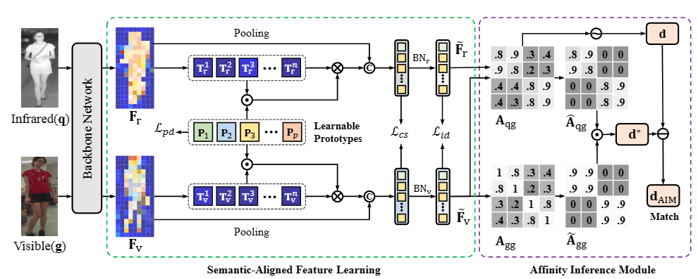

# SAAI
The implementation of ICCV 2023 "[Visible-Infrared Person Re-Identification via Semantic Alignment and Affinity Inference]()".



## :sparkles: News
- 2023-8-26: Release codes and our pretrained models at [Baidudisk](https://pan.baidu.com/s/15dLeBPIzGpi7GG0TMUzkkg?pwd=iccv) (r8vb).


## Getting Started

### Testing

1. Download the dataset and pretrained models (checkpoints) from [Baidudisk](https://pan.baidu.com/s15dLeBPIzGpi7GG0TMUzkkg?pwd=iccv) (r8vb), unzip them.
2. Download the training data SYSU, unzip and put it in correct position.
3. Change the dataset path in the file `configs/default/dataset.py`
4. Run the following command to retrain the model. You need about 22G GPU for the training.

```shell
chmod 755 test.sh
./test
```

### Training

1. Download the training data SYSU, unzip and put it in correct position.
2. Change the dataset path in the file `configs/default/dataset.py`
3. Run the following command to retrain the model. You need about 22G GPU for the training.

```shell
chmod 755 train.sh
./train
```

## Requirement
```
numpy==1.24.2
torch==2.0.0
torchvision==0.15.1
PyYAML==6.0
pytorch-ignite==0.1.2
```


## Citation
If you find our work useful for your research, please consider citing the following papers :)

```bibtex
@InProceedings{Fang_2023_ICCV,
    author    = {Fang, Xingye and Yang, Yang and Fu, Ying},
    title     = {Visible-Infrared Person Re-Identification via Semantic Alignment and Affinity Inference},
    booktitle = {Proceedings of the IEEE/CVF International Conference on Computer Vision (ICCV)},
    month     = {October},
    year      = {2023},
    pages     = {11270-11279}
}
``` 

## Contact
If you find any problem, please feel free to contact me (fangxingye@bit.edu.cn). A brief self-introduction is required, if you would like to get an in-depth help from me.